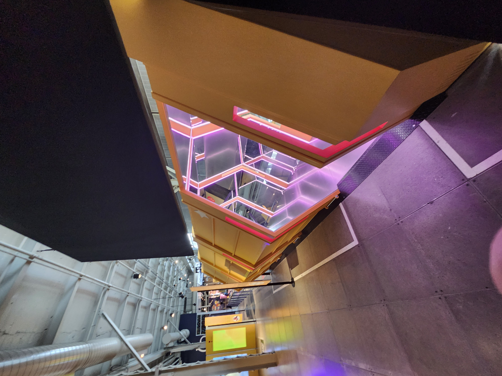
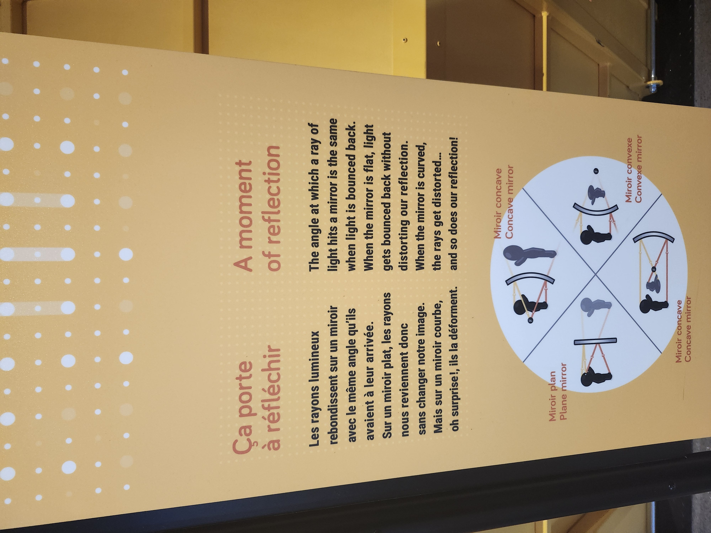
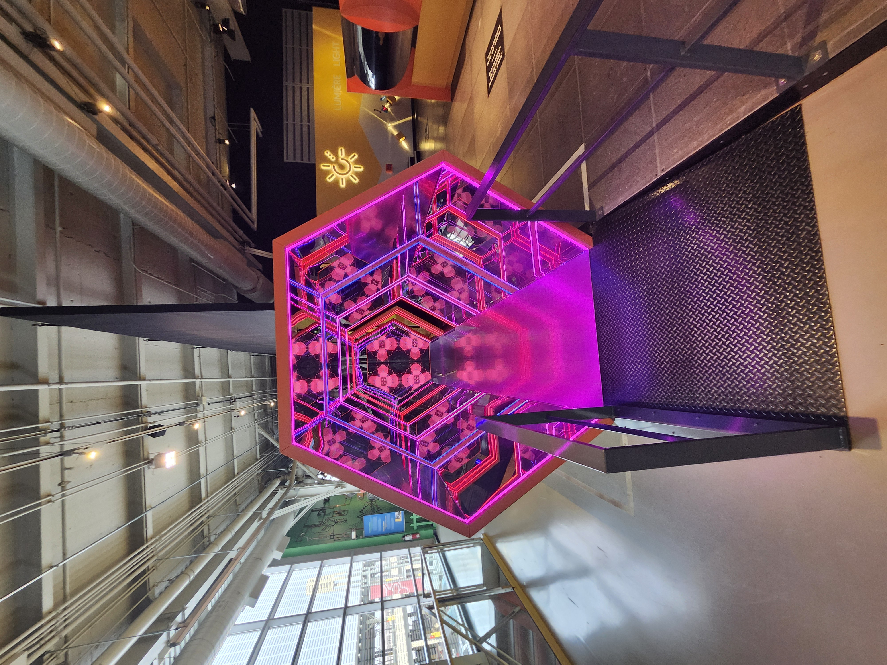
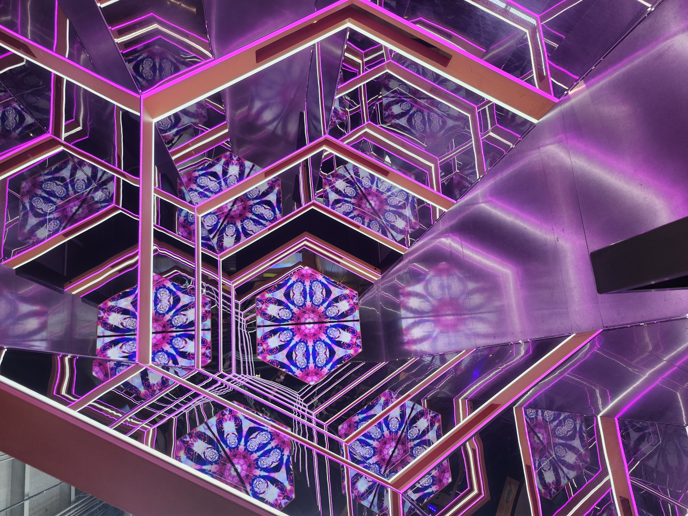
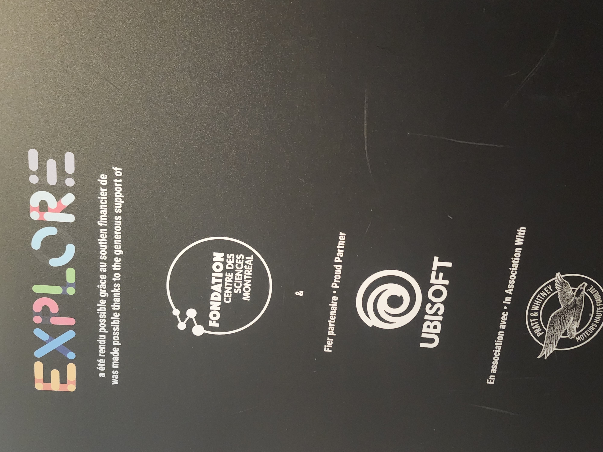

# Banque D'Inspiration du centre des sciences

## Exposition permanante "Explore"

### Le Tunnel de Mirroire

Visite effectuée le 31 Janvier 2025

 

Cet attraction est situé au tout début de l'exposition, et devrais être la première que les visiteurs vont voir sous des circonstences normales car celui-ci est la seule entré de l'exposition a moins que le visiteur entre par la sorite. L'attraction elle même n'avais pas de nom exacte.

# Description

Cette attraction principalement immersive est constitué d'un semi-long tunnel en forme de prisme hexagonal. Chaque mur et le plafont de ce tunnel sont des mirroir. Placé une peu partout dans le tunnel, il y a des lumières qui change de couleures progressivement, tout de bleu foncé au rouge sang. Le sol est en métal relativement réflectif, mais moins que le mirroires évidemment. La première base du prisme placé a l'horizontale est l'entrée alors qu'il y a un trou sur un des murs à la fin qui laisse les visiteurs entrer dans l'exposition elle même. Les Instruction de sont fonctionnement sont placée sur la pancarte signaturement jaune mais au lieu d'être au début de l'attraction, celle-ci est placée après y avoir sorti, pour ne pas briser l'immersion. Seul le tunnel de mirroir lui-même est requis pour son fonctionnement, car il n'y a aucune partie qui bouge, a part les lumières à l'intérieure du tunnel lui-même, qui ne peut vraiment être pleinement être intéragi avec car ce sont les mirroires qui font tout le travail, et non les visiteurs.

### Vue Des Alentours

## Instructions

### D'autres Photos pertinentes

    

(Les vidéos que j'ai pris était trop lourds pour aller sur Github, et n'était pas vraiment capable d'être coupé sans manquer d'infos importante. Désolé)

## Expérience Vécue

J'ai beacoup aimée cet attraction, car vue qu'elle est placée directement a l'entrée principale de l'exposition, est qu'elle est pleine de couleures et d'effets, elle donne l'impression immersive de se faire transporter dans un monde hors du commun. C'est quand même aussi intéressant car il y a plusieurs mur de bois peint noir autours du tunnel lui-même, qui cache la vue directement autour, la couleure du sol change lorsque l'on entre dans l'exposition elle-même, ce qui renforce cet effet encore plus.

# Crédits principaux de l'exposition.

(J'ai perdu les autres images des crédits)
