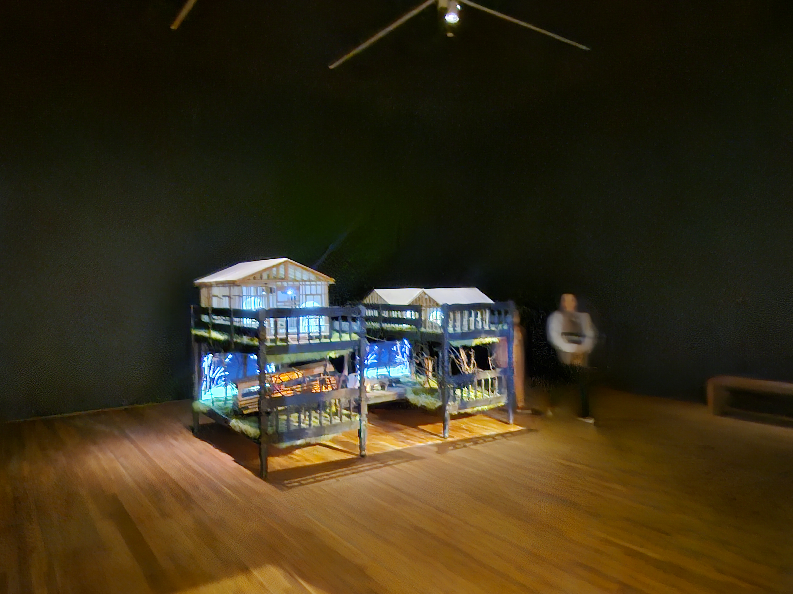
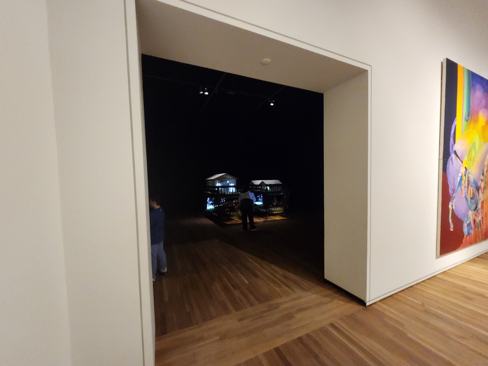
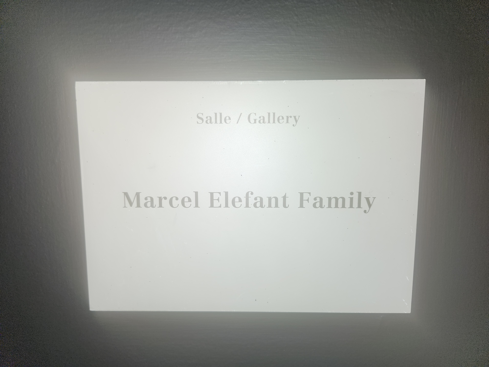
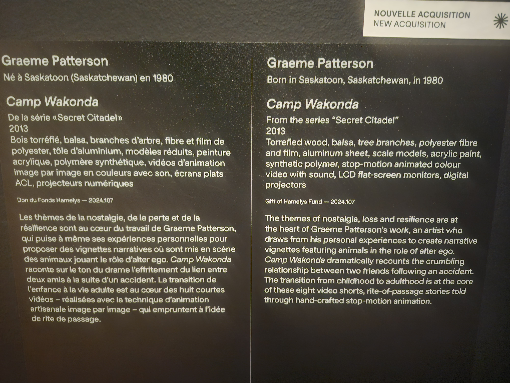
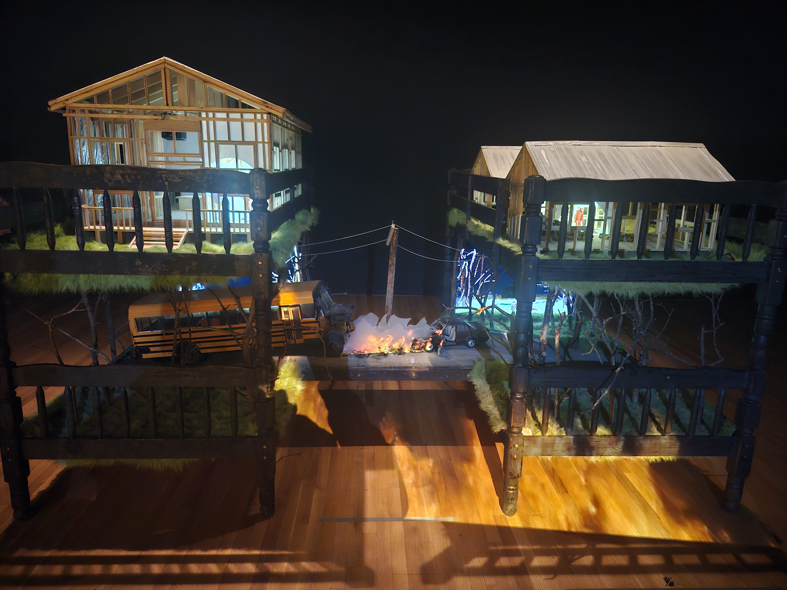
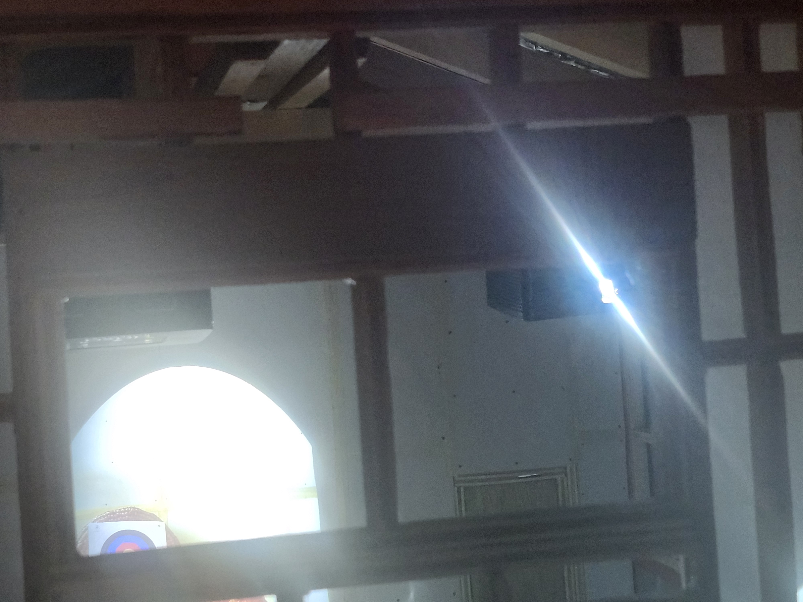

# Banque D'inspration Musée des Beaux Arts de Montréal

## Salle Marcel Elefant Family

### Camp Wakonda

   

Cet attraction est situé à l'arrière de l'exposition, dans une salle sombre. Dans L'exposition Marcel Elefant Family  

   

## Description

L'attraction "Camp Wankonda" est situé dans une salle peu illuminé, avec une projecteur sur un des murs. La maquette elle même démontre un campement construit par 2 adolescant après un accident de voiture entre un autobus d'école et une autre voiture quelconque. I'l y a deux niveaux de hauteure à la maquette.  

  

Où le Niveaux de bas démontre L'accident, et le niveaux plus haut démontre les cabanes que les 2 adolescants aurait construit. Le projecteur sur le mur de la pièce projete un effet de feu sur l'endroit de l'accident, accompanié d'effets sonore par des boîtes sonore caché à plusieur parties de la maquette.  

  

Chaque pièce principales des cabanes on un projecteur qui projete des courtes vidéos des adolescant au milieux de leurs activités chaques jours, alors que les niveaux plus bas projetent des vidéos des 2 ado en train de chasser au meilleur de leurs abiletées. Tous Accompaniés d'effets sonores.

