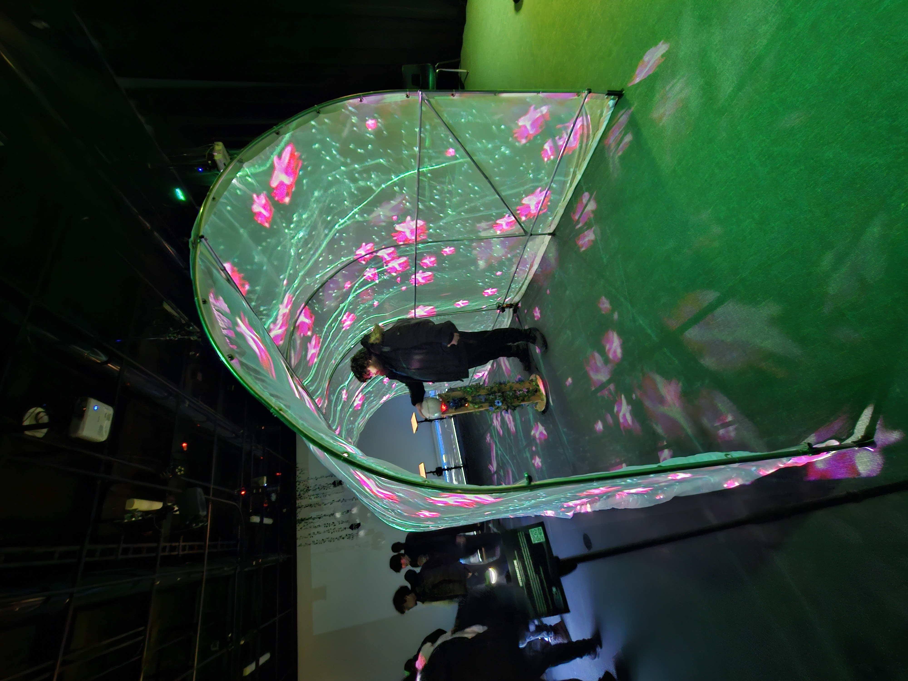
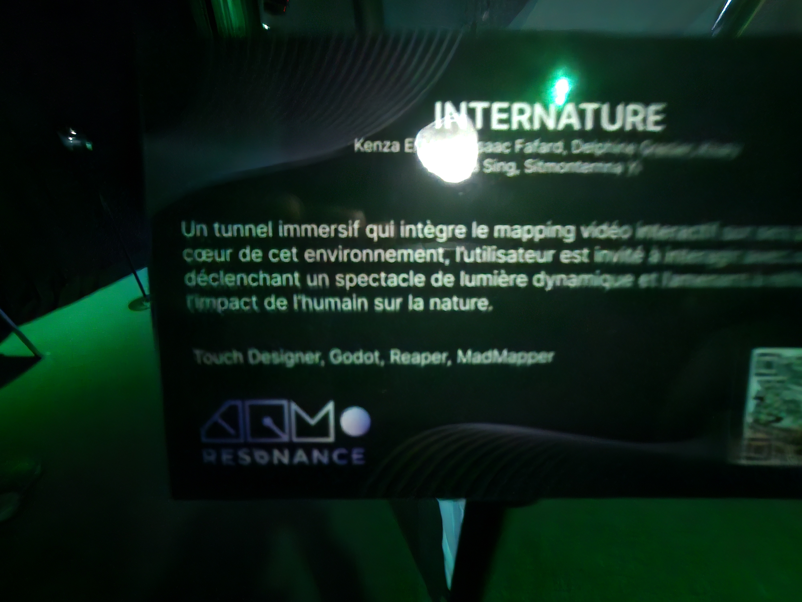

# Banque D'inspiration semaine des arts

## Exposition temporaire "Resonance"

### Listes des autres dispositifs, en ordres de ceux que j'ai aimé le plus

#### 2eme Place: "Internature"

 

(Désolé Je n'ai pas pris de meilleure photo de la description)

Internature était mon deuxième choix, et était incroyablement proche d'être mon favoris, mais j'ai décidé de changer ma décision à la dernière minute. Le globe du milieux est en une sorte de suspension, et en le tourant, il fait déplacer les petite étoiles partout dans le tunnel. J'aime beaucoup l'effet immersif que cela produit
