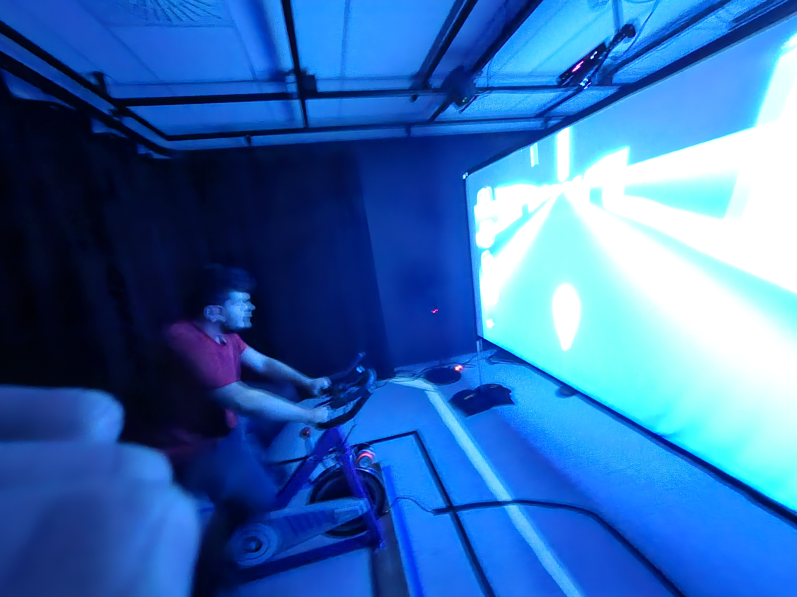

# Banque D'inspiration semaine des arts

## Exposition temporaire "Resonance"

### Listes des autres dispositifs, en ordres de ceux que j'ai aimé le plus

##
## 2eme Place: "Internature"

 

(Désolé Je n'ai pas pris de meilleure photo de la description)

Internature était mon deuxième choix, et était incroyablement proche d'être mon favoris, mais j'ai décidé de changer ma décision à la dernière minute. Le globe du milieux est en une sorte de suspension, et en le tourant, il fait déplacer les petite étoiles partout dans le tunnel. J'aime beaucoup l'effet immersif que cela produit. Je pense que les cours incontournable pour cette insallation serais: Réalité mixte, Objets interactifs, et installation multimédia.

Scénario: https://tprangers.github.io/internature/#/20_intention/30_scenario/

##
## 3eme Place: C0N-DU8

 

Con-Du8 est très intéressant, un dispositif qui simule une course à vélo où pédaler fait avancer le vélo de l'écran. Il n'y a pas beacoup à ce dispositif, mais il est très intéressant tous de même. Je pense que les cours incontournable pour cette insallation serais: Intéractivité ludique, Objets Intéractifs, conception d'une expérience multimédia.

Scénario: https://gearshift-games.github.io/Web-C0N-DU8/#/20_intention/30_scenario/

##
## 4eme Place: Fuga

<video src="ImagesEnsembles/FugaVideo.mp4" width="350" height="400" alt="Video de Fuga"> Le Video ne marche Pas :( </video>

Fuga était quand même intéressant même si je l'ai moins aimé

