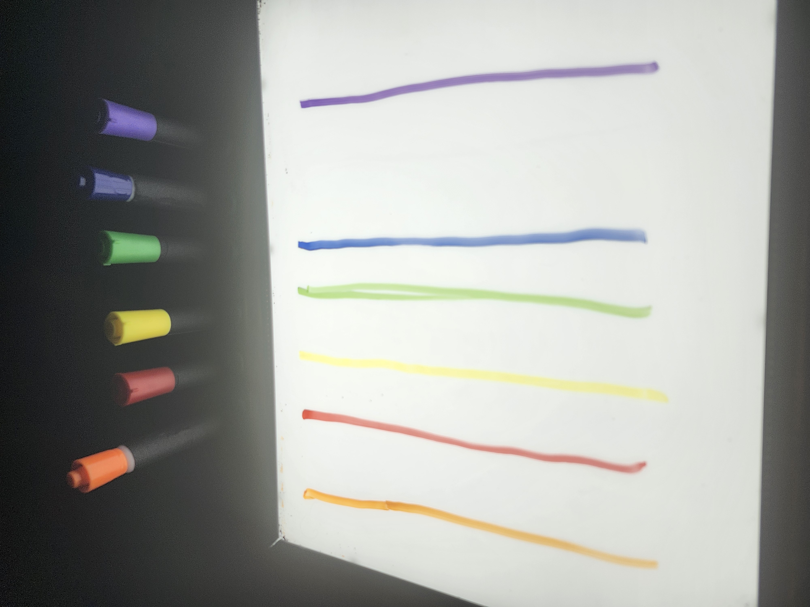

# Banque D'inspiration semaine des arts

## Exposition temporaire "Resonance"

### Mon dispositif préféré: "Prismatica"

Visité le mardi 18 mars 2025

  

#
# Description 

Prismatica une attraction multisensoriel, surtout intéractive et immersive, est dans le petit studio et consiste de trois éléments: L'écran, le tableau blanc, et les écouteurs­. Il y à une caméra au dessus du tableau blanc qui est branché à l'écran. À coté du tableau blanc, il y a 6 crayons colorés (Orange, Rouge, Jaune, Vert, Bleu et Violet)

Chaque couleure, lorsque l'on descine sur le tableau blanc, la couleure respective apparaitrera sur l'écran, accompanié d'une séries de sons, qui est différente dépendant de la couleure choisie.

- Le Orange fait des sons chaleureux, et rond.
- Le Rouge fait des son percusifs continue qui ont une sorte de profodeur
- Le Jaune donne une ambience sonnant un peu comme de la lumière
- Le Vert donne des sons harmonieux, qui donne un sensation d'équilibre et de tranquilité
- Le Bleu donne un ambience tranquille et profonde avec des sons qui sonnent comme des bulles sous l'eau qui enveloppent
- Le Violet donne une ambience aériene, comme si on n'était en hauteur
  
> (Désolé si ces description ne sont pas super, je n'ai jamais été très bon à décrire des effets sonore)

#### Vue de dessous

##
## Expérience Vécue

Cette attraction était ma préférée car il y avait beaucoup de parties qui bouge, la combinaisons des écouteurs, avec les couleures qui donnaient des sons différents pour chaques couleure ainsi que des son plus intenses si il y avait plus d'une couleur était très attrayant pour moi. Cela donnait vraiment l'effet multisensoriel que les créateurs voulaient. Mais J'ai aussi remarqué quelques erreures mineures; parfois, le Jaune était recconu comme du vert par la caméra, ce n'arrivait pas souvent, mais cela à rendu les testes plus difficiles. Aussi, vue que la caméra qui détecte les couleures du tableau est placée au-dessus du tableau, cela rendait les teste beaucoup plus dur, car souvent, nos bras cachaient les couleures, et les fesaient disparaitre de l'écran.

> (Les crédits sont dans la description)
