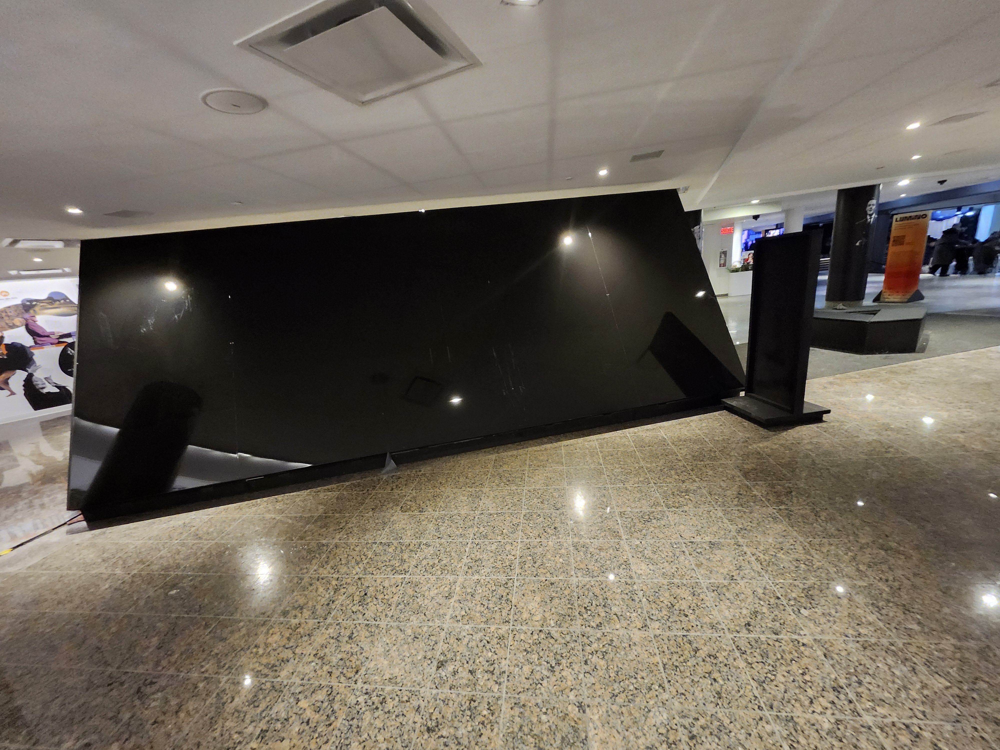
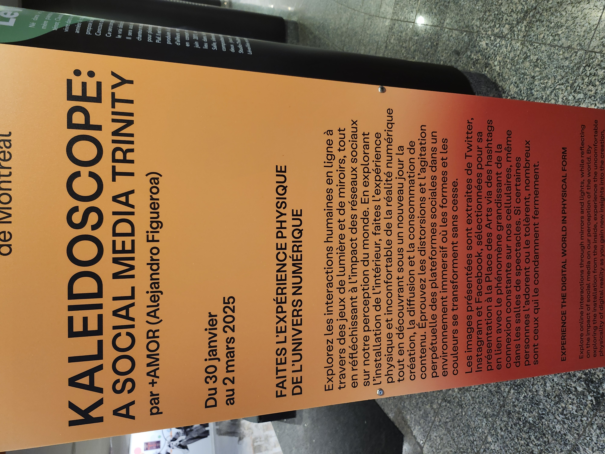
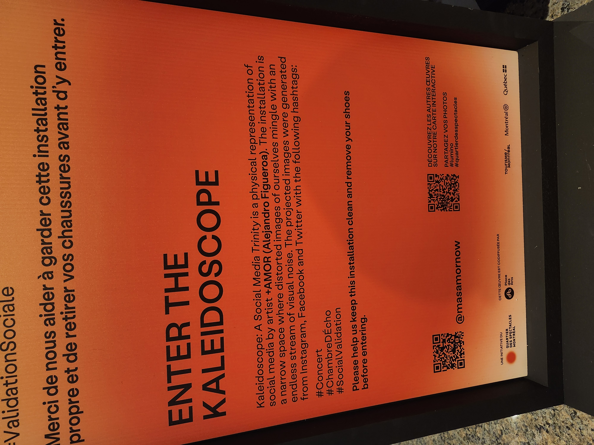
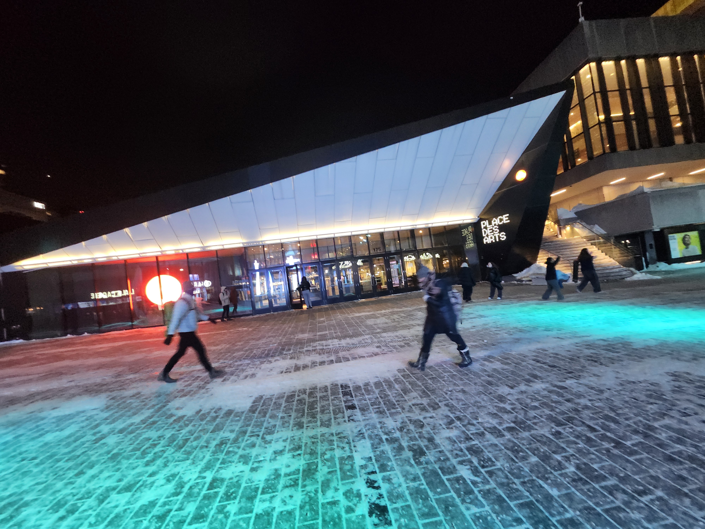

# Banque D'Inspiration Visite Individuelle.

## Exposition Temporaire: "Lumino"

### Kaleidoscope

Visite Effectuée le 21 février 2025

   

   

Cette Attraction est une des seules attractions intérieures de lumino, la plupars sont extérieures. Elle est située directement à coté d'une des entrées de la place des arts de Montréal

> Devans cette Entrée (L'entrée Est de la place des arts), pour être plus specifique.

## Description
