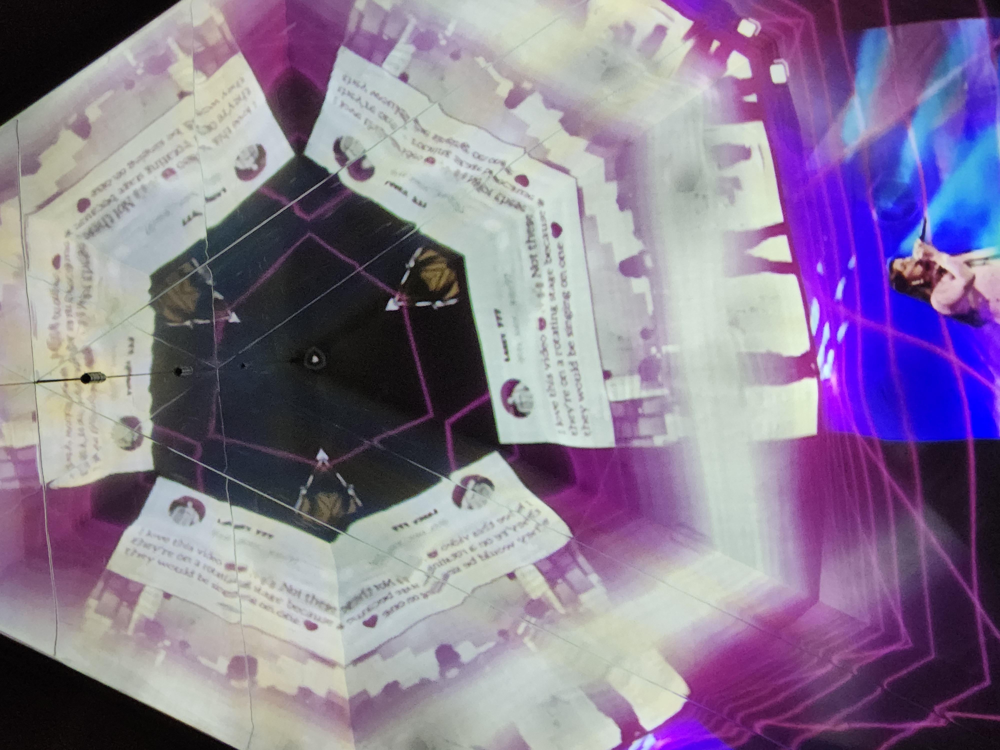
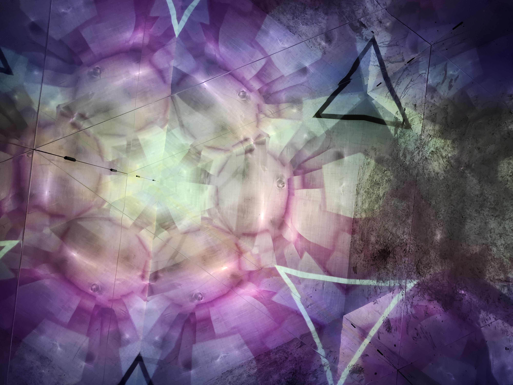
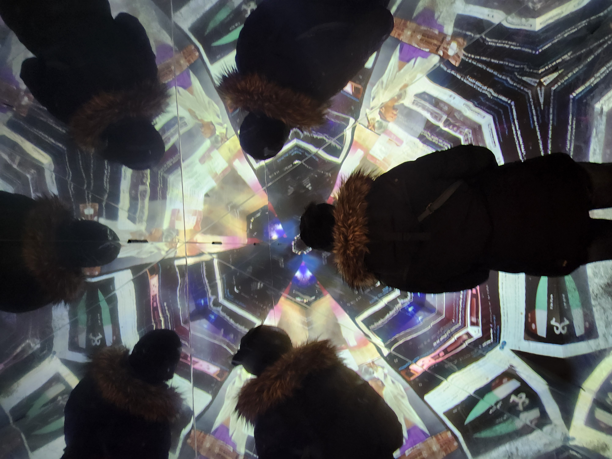

# Banque D'Inspiration Visite Individuelle.

## Exposition Temporaire: "Lumino"

### Kaleidoscope

Visite Effectuée le 21 février 2025

   

   

Cette Attraction est une des seules attractions intérieures de lumino, la plupars sont extérieures. Elle est située directement à coté d'une des entrées de la place des arts de Montréal

> Devans cette Entrée (L'entrée Est de la place des arts), pour être plus specifique.

## Description

L' attraction "Kaleidoscope" est une attraction immersive temporaire (Qui durait du 30 Janvier au 2 Mars 2025), celle-ci est un tunnel en forme de prisme triangulaire. Les murs intérieurs sont des mirroir le sol est en métal, et le mur du fond est un projecteur pour l'écran qui défile les images. Les images, qui semble un assortement de couleures et d'images de réseaux sociaux.  

   

Les mirroires sur les murs reflètent les images continuellement pour faire une sorte d'effet psychédélique. Le fonctionement du dispositif est automatique et est pris en charge par le créateur de l'oeuvre, qui était présent sur place pour faire le panorama des images qui serait défilé. Cela veut dire que tant que celui-ci n'est pas présent **L'attraction est désactivé et ne fonctionne pas**. Durant la visite, la personne qui s'occupe de l'attraction est arrivé vers 6h30 PM.

### Photo avec une Personne à l'intérieur pour mieux démontrer le mirroires

